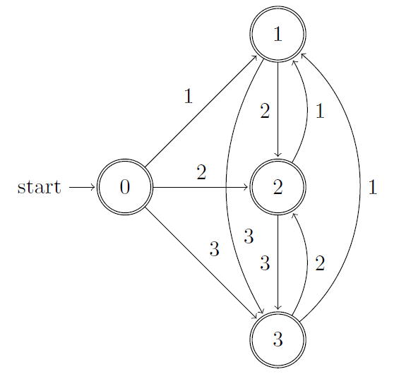
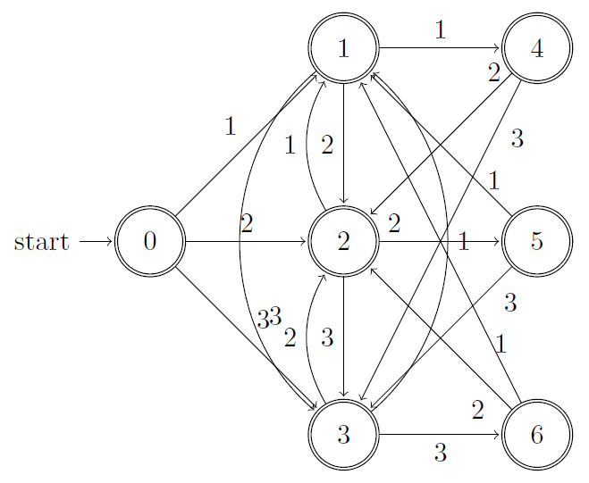

## 3.4 Recognition of Tokens

### 3.4.1

> Provide transition diagrams to recognize the same languages as each of the regular expressions in Exercise 3.3.2.
> 
> a\) $$\mathbf{a}(\mathbf{a}|\mathbf{b})^*\mathbf{a}$$.

> b\) $$((ϵ|\mathbf{a})\mathbf{b}^*)^*$$.

> c\) $$(\mathbf{a}|\mathbf{b})^*\mathbf{a}(\mathbf{a}|\mathbf{b})(\mathbf{a}|\mathbf{b})$$.

> d\) $$\mathbf{a}^*\mathbf{b}\mathbf{a}^*\mathbf{b}\mathbf{a}^*\mathbf{b}\mathbf{a}^*$$.

> e\) $$(\mathbf{a}\mathbf{a}|\mathbf{b}\mathbf{b})^*((\mathbf{a}\mathbf{b}|\mathbf{b}\mathbf{a})(\mathbf{a}\mathbf{a}|\mathbf{b}\mathbf{b})^*(\mathbf{a}\mathbf{b}|\mathbf{b}\mathbf{a})(\mathbf{a}\mathbf{a}|\mathbf{b}\mathbf{b})^*)^*$$

Nonsense.

### 3.4.2

> Provide transition diagrams to recognize the same languages as each of the regular expressions in Exercise 3.3.5.
> 
> d\) All strings of digits with no repeated digits.

> e\) All strings of digits with at most one repeated digit.

### 3.4.3

> Construct the failure function for the strings:
> 
> a\) abababaab.

001234512

> b\) aaaaaa.

012345

> c\) abbaabb.

0001123

### 3.4.4

See _32.4 The Knuth-Morris-Pratt algorithm_ in **CLRS**.

### 3.4.5

See 3.4.4.

### 3.4.6

> a\) abababaab.

12343456

> b\) abababbaa.

123434011

