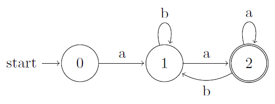
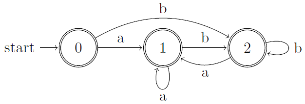
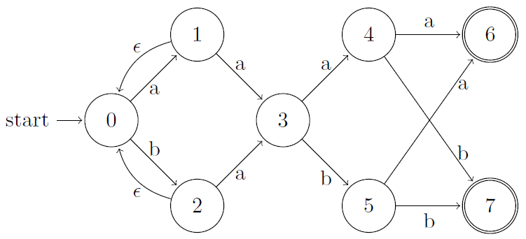
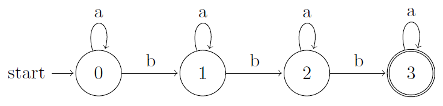

## 3.4 Recognition of Tokens

### 3.4.1 

> Provide transition diagrams to recognize the same languages as each of the regular expressions in Exercise 3.3.2.

> a) $$\mathbf{a}(\mathbf{a}|\mathbf{b})^*\mathbf{a}$$.

> b) $$((ϵ|\mathbf{a})\mathbf{b}^*)^*$$.

> c) $$(\mathbf{a}|\mathbf{b})^*\mathbf{a}(\mathbf{a}|\mathbf{b})(\mathbf{a}|\mathbf{b})$$.

> d) $$\mathbf{a}^*\mathbf{b}\mathbf{a}^*\mathbf{b}\mathbf{a}^*\mathbf{b}\mathbf{a}^*$$.

> e) $$(\mathbf{a}\mathbf{a}|\mathbf{b}\mathbf{b})^*((\mathbf{a}\mathbf{b}|\mathbf{b}\mathbf{a})(\mathbf{a}\mathbf{a}|\mathbf{b}\mathbf{b})^*(\mathbf{a}\mathbf{b}|\mathbf{b}\mathbf{a})(\mathbf{a}\mathbf{a}|\mathbf{b}\mathbf{b})^*)^*$$

Nonsense.
