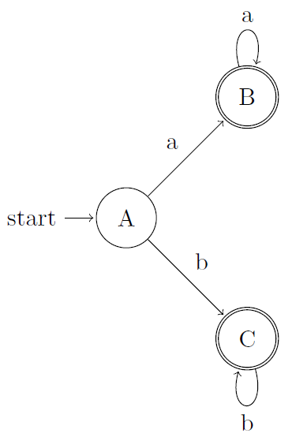
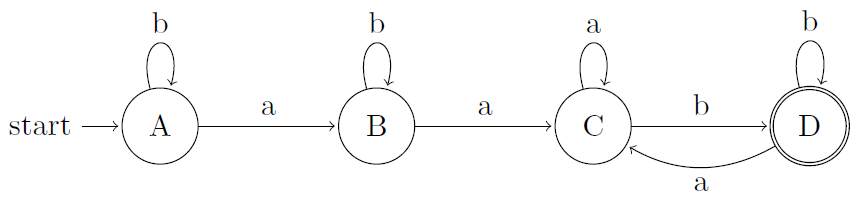

## 3.7 From Regular Expressions to Automata

### 3.7.1

> Convert to DFS's the NFA's of:

> a) Fig. 3.26.

| NFA STATE | DFA STATE | $$a$$ | $$b$$ |
|:---------:|:---------:|:-----:|:-----:|
|$$\{0,1,3\}$$|$$A$$|$$B$$|$$C$$|
|$$\{2\}$$|$$B$$|$$B$$|$$\emptyset$$|
|$$\{4\}$$|$$C$$|$$\emptyset$$|$$C$$|

> b) Fig. 3.29.

| NFA STATE | DFA STATE | $$a$$ | $$b$$ |
|:---------:|:---------:|:-----:|:-----:|
|$$\{0\}$$|$$A$$|$$B$$|$$A$$|
|$$\{0, 1\}$$|$$B$$|$$C$$|$$B$$|
|$$\{0, 1, 2\}$$|$$C$$|$$C$$|$$D$$|
|$$\{0, 1, 2, 3\}$$|$$D$$|$$C$$|$$D$$|

> c) Fig. 3.30.

| NFA STATE | DFA STATE | $$a$$ | $$b$$ |
|:---------:|:---------:|:-----:|:-----:|
|$$\{0, 1, 2, 3\}$$|$$A$$|$$A$$|$$A$$|

### 3.7.2

> use Algorithm 3.22 to simulate the NFA's:

> a) Fig. 3.29.

> b) Fig. 3.30.

### 3.7.3

> Convert the following regular expressions to deterministic finite automata, using algorithms 3.23 and 3.20:

> a) $$(a|b)*$$

> b) $$(a*|b*)*$$

> c) $$((\epsilon|a)b*)*$$

> d) $$(a|b)*abb(a|b)*$$
