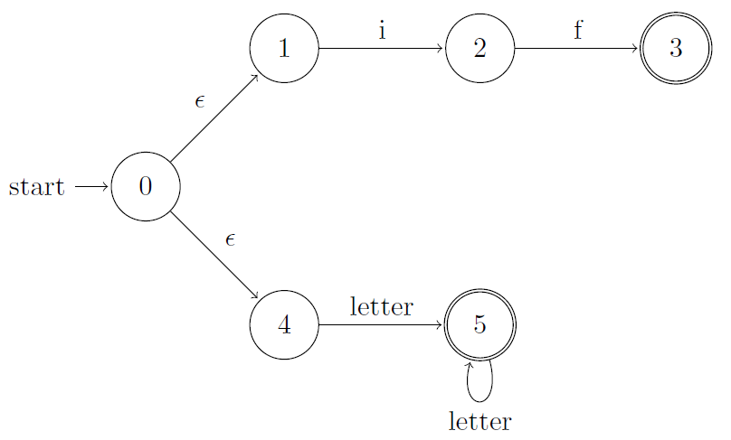
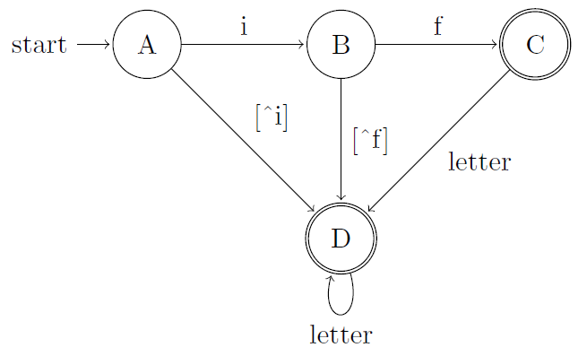

## 3.8 Design of a Lexical-Analyzer Generator

### 3.8.1

> Suppose we have two tokens: (1) the keyword `if`, and (2) identifiers, which are strings of letters other than `if`. Show:

> a) The NFA for these tokens, and

> b) The DFA for these tokens.

### 3.8.2

> Repeat Exercise 3.8.1 for tokens consisting of (1) the keyword `while`, (2) the keyword `when`, and (3) identifiers consisting of strings of letters and digits, beginning with a letter.

### 3.8.3

> Suppose we were to revise the definition of a DFA to allow zero or one transition out of each state on each input symbol. Some regular expressions would then have smaller "DFA's" than they do under the standard definition of a DFA. Give an example of one such regular expression.
