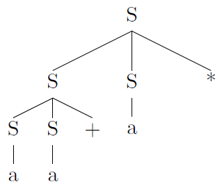
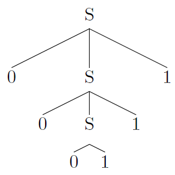
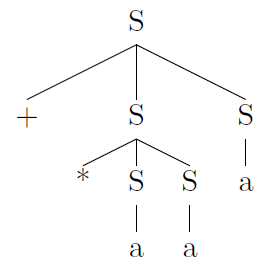

## 4.2 Context-Free Grammars

### 4.2.1

> Consider the context-free grammar:

> $$ S~\rightarrow~S~S~+~|~S~S~*~|~a$$

> and the string $$aa+a*$$.

> a) Give a leftmost derivation for the string.

$$
\begin{array}{rll}
S &\underset{lm}{\Rightarrow}& SS* \\
&\underset{lm}{\Rightarrow}& SS+S* \\
&\underset{lm}{\Rightarrow}& aS+S* \\
&\underset{lm}{\Rightarrow}& aa+S* \\
&\underset{lm}{\Rightarrow}& aa+a* \\
\end{array}
$$

> b) Give a rightmost derivation for the string.

$$
\begin{array}{rll}
S &\underset{rm}{\Rightarrow}& SS* \\
&\underset{rm}{\Rightarrow}& Sa* \\
&\underset{rm}{\Rightarrow}& SS+a* \\
&\underset{rm}{\Rightarrow}& Sa+a* \\
&\underset{rm}{\Rightarrow}& aa+a* \\
\end{array}
$$

> c) Give a parse tree for the string.

> d) Is the grammar ambiguous or unambiguous? Justify your answer.

Unambiguous.

> e) Describe the language generated by this grammar.

Suffix expressions.

### 4.2.2

> Repeat Exercise 4.2.1 for each of the following grammars and strings:

> a) $$S~\rightarrow~0~S~1~|~0~1$$ with string $$000111$$.

$$
\begin{array}{rll}
S &\underset{lm}{\Rightarrow}& 0S1 \\
&\underset{lm}{\Rightarrow}& 00S11 \\
&\underset{lm}{\Rightarrow}& 000111 \\
\end{array}
$$

$$
\begin{array}{rll}
S &\underset{rm}{\Rightarrow}& 0S1 \\
&\underset{rm}{\Rightarrow}& 00S11 \\
&\underset{rm}{\Rightarrow}& 000111 \\
\end{array}
$$

Unambiguous.

> b) $$S~\rightarrow~+~S~S~|~*~S~S~|~a$$ with string $$+*aaa$$.

$$
\begin{array}{rll}
S &\underset{lm}{\Rightarrow}& +SS \\
&\underset{lm}{\Rightarrow}& +*SSS \\
&\underset{lm}{\Rightarrow}& +*aSS \\
&\underset{lm}{\Rightarrow}& +*aaS \\
&\underset{lm}{\Rightarrow}& +*aaa \\
\end{array}
$$

$$
\begin{array}{rll}
S &\underset{rm}{\Rightarrow}& +SS \\
&\underset{rm}{\Rightarrow}& +Sa \\
&\underset{rm}{\Rightarrow}& +*SSa \\
&\underset{rm}{\Rightarrow}& +*Saa \\
&\underset{rm}{\Rightarrow}& +*aaa \\
\end{array}
$$

Unambiguous.

> c) $$S~\rightarrow~S~(~S~)~S~|~\epsilon$$ with string $$(()())$$.

