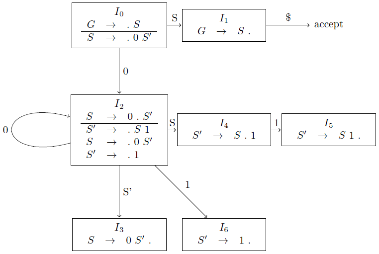

## 4.6 Introduction to LR Parsing: Simple LR

### 4.6.1

> Describe all the viable prefixes for the following grammars:

> a) The grammar $$S~\rightarrow~0~S~1~|~0~1$$ of Exercise 4.2.2(a).

$$\begin{array}{lcl}
G &\rightarrow& S \\
S &\rightarrow& 0~S' \\
S' &\rightarrow& S~1~|~1 \\
\end{array}$$

> b) The grammar $$S~\rightarrow~S~S~+~|~S~S~*~|~a$$ of Exercise 4.2.1.

> c) The grammar $$S~\rightarrow~S~(~S~)~|~\epsilon$$ of Exercise 4.2.2(c).

