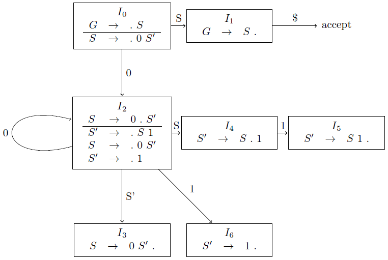
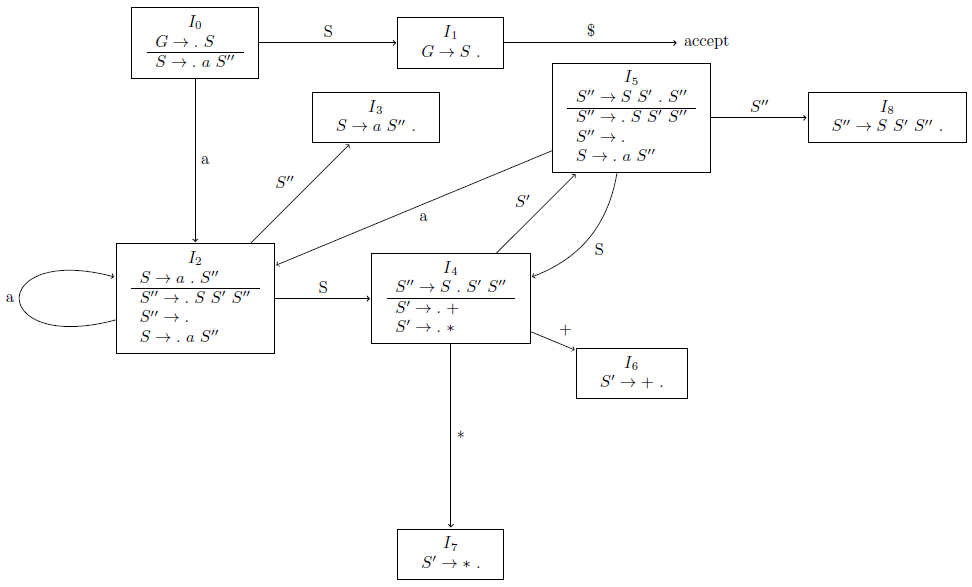
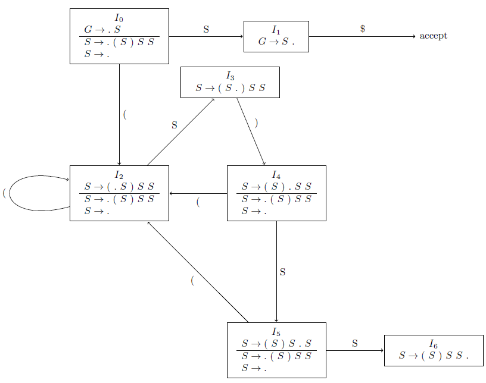

## 4.6 Introduction to LR Parsing: Simple LR

### 4.6.1

> Describe all the viable prefixes for the following grammars:

> a) The grammar $$S~\rightarrow~0~S~1~|~0~1$$ of Exercise 4.2.2(a).

$$\begin{array}{lcl}
S &\rightarrow& 0~S' \\
S' &\rightarrow& S~1~|~1 \\
\end{array}$$

Viable prefixes: $$0+$$

> b) The grammar $$S~\rightarrow~S~S~+~|~S~S~*~|~a$$ of Exercise 4.2.1.

$$\begin{array}{lcl}
S &\rightarrow& a~S^{\prime\prime} \\
S^{\prime\prime} &\rightarrow& S~S^\prime~S^{\prime\prime}~|~\epsilon \\
S^\prime &\rightarrow& +~|~* \\
\end{array}$$

Viable prefixes: $$S*$$

> c) The grammar $$S~\rightarrow~S~(~S~)~|~\epsilon$$ of Exercise 4.2.2(c).

$$\begin{array}{lcl}
S &\rightarrow& (~S~)~S~S~|~\epsilon \\
\end{array}$$

Viable prefixes: $$(*$$

### 4.6.2

> Construct the SLR sets of items for the (augmented) grammar of Exercise 4.2.1. Compute the GOTO function for these sets of items. Show the parsing table for this grammar. Is the grammar SLR?

> a) The grammar $$S~\rightarrow~0~S~1~|~0~1$$ of Exercise 4.2.2(a).

$$\begin{array}{lcl}
G &\rightarrow& S \\
S &\rightarrow& 0~S' \\
S' &\rightarrow& S~1~|~1 \\
\end{array}$$

| STATE | $$0$$ | $$1$$ | $$\$$$ | $$S$$ | $$S'$$ |
|:-----:|:-----:|:-----:|:------:|:-----:|:------:|
| 0 | s2 | | | 1 | |
| 1 | | | acc | | |
| 2 | s2 | s6 | | 4 | 3 |
| 3 | | r($$S \rightarrow 0~S'$$) | r($$S \rightarrow 0~S'$$) | | |
| 4 | | s5 | | | |
| 5 | | r($$S \rightarrow S~1$$) | r($$S \rightarrow S~1$$) | | |
| 6 | | r($$S \rightarrow 1$$) | r($$S \rightarrow 1$$) | | |

It is SLR.

> b) The grammar $$S~\rightarrow~S~S~+~|~S~S~*~|~a$$ of Exercise 4.2.1.

$$\begin{array}{lcl}
G &\rightarrow& S \\
S &\rightarrow& a~S^{\prime\prime} \\
S^{\prime\prime} &\rightarrow& S~S^\prime~S^{\prime\prime}~|~\epsilon \\
S^\prime &\rightarrow& +~|~* \\
\end{array}$$

| STATE | $$a$$ | $$+$$ | $$-$$ | $$\$$$ | $$S$$ | $$S'$$ | $$S^{\prime\prime}$$ |
|:-----:|:-----:|:-----:|:-----:|:------:|:------:|:------:|:------:|
| 0 | s2 |  |  |  | 1 |  |  |
| 1 |  |  |  | acc |  |  |  |
| 2 | s2 | r($$S^{\prime\prime} \rightarrow \epsilon$$) | r($$S^{\prime\prime} \rightarrow \epsilon$$) | r($$S^{\prime\prime} \rightarrow \epsilon$$) | 4 |  | 3 |
| 3 | s2 | r($$S \rightarrow aS^{\prime\prime}$$) | r($$S \rightarrow aS^{\prime\prime}$$) | r($$S \rightarrow aS^{\prime\prime}$$) |  |  |  |
| 4 |  | s6 | s7 |  |  | 5 |  |
| 5 | s2 | r($$S^{\prime\prime} \rightarrow \epsilon$$) | r($$S^{\prime\prime} \rightarrow \epsilon$$) | r($$S^{\prime\prime} \rightarrow \epsilon$$) | 4 |  | 8 |
| 6 | r($$S' \rightarrow +$$) | r($$S' \rightarrow +$$) | r($$S' \rightarrow +$$) | r($$S' \rightarrow +$$) |  |  |  |
| 7 | r($$S' \rightarrow *$$) | r($$S' \rightarrow +$$) | r($$S' \rightarrow +$$) | r($$S' \rightarrow +$$) |  |  |  |
| 8 |  | r($$S^{\prime\prime} \rightarrow SS^\prime S^{\prime\prime}$$) | r($$S^{\prime\prime} \rightarrow SS^\prime S^{\prime\prime}$$) | r($$S^{\prime\prime} \rightarrow SS^\prime S^{\prime\prime}$$) |  |  |  |

It is SLR.

> c) The grammar $$S~\rightarrow~S~(~S~)~|~\epsilon$$ of Exercise 4.2.2(c).

$$\begin{array}{lcl}
G &\rightarrow& S \\
S &\rightarrow& (~S~)~S~S~|~\epsilon \\
\end{array}$$

It is not SLR.
