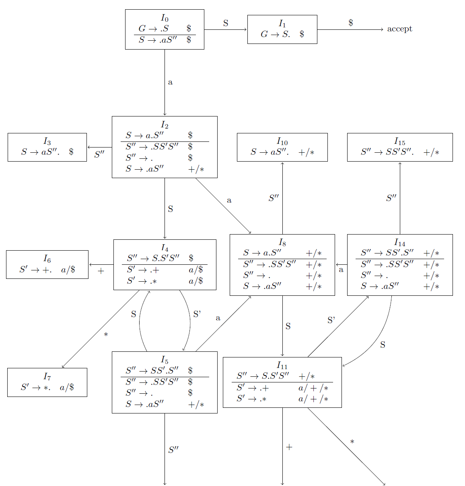

## 4.7 More Powerful LR Parsers

### 4.7.1

> Construct the

> a) canonical LR, and

> b) LALR

> sets of items for grammar $$~S~\rightarrow~S~S~+~|~S~S~*~|~a$$ of Exercise 4.2.1.

$$\begin{array}{lcl}
S &\rightarrow& a~S^{\prime\prime} \\
S^{\prime\prime} &\rightarrow& S~S^\prime~S^{\prime\prime}~|~\epsilon \\
S^\prime &\rightarrow& +~|~* \\
\end{array}$$

* LR(1)

* LALR
