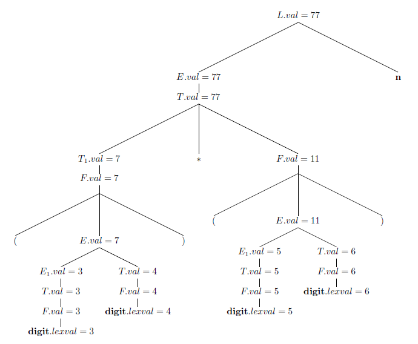
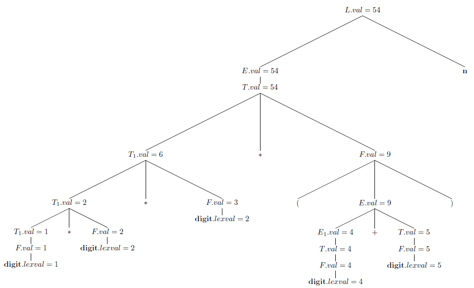
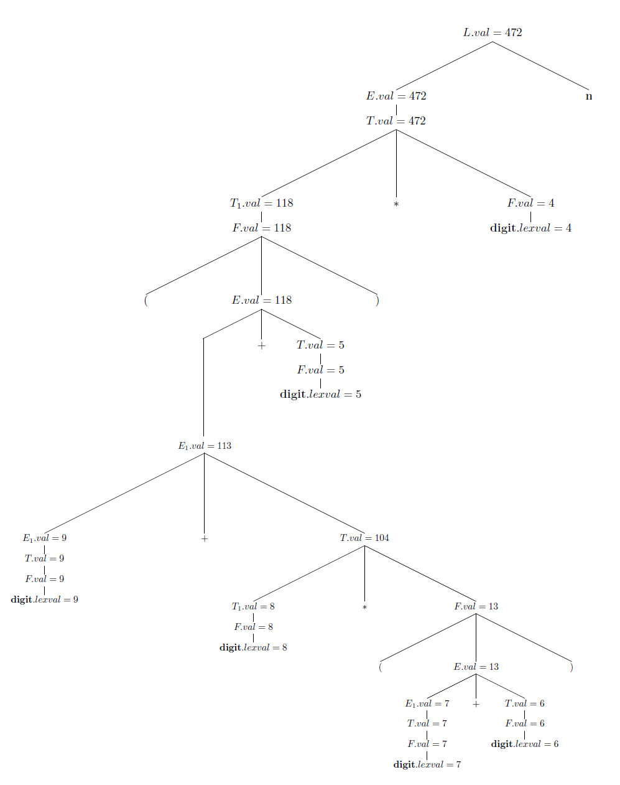

## 5.1 Syntax-Directed Definitions

### 5.1.1

> For the SDD of Fig. 5.1, give annotated parse trees for the following expressions:

> a) $$(3+4)*(5+6)~\mathbf{n}$$.

> b) $$1*2*3*(4+5)~\mathbf{n}$$.

> c) $$(9 + 8 * (7 + 6) + 5) * 4~\mathbf{n}$$.

### 5.1.2

> Extend the SDD of Fig. 5.4 to handle expressions as in Fig. 5.1.
 
### 5.1.3

> Repeat Exercise 5.1.1, using your SDD from Exercise 5.1.2.
