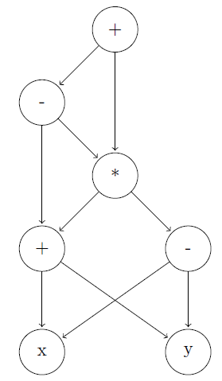

## 6.1 Variants of Syntax Trees

### 6.1.1

> Construct the DAG for the expression

> $$((x + y) - ((x + y) * (x - y))) + ((x + y) * (x - y))$$

### 6.1.2

> Construct the DAG and identify the value numbers for the subexpressions of the following expressions, assuming $$+$$ associates from the left.
 
> a) $$a + b + (a + b)$$.

| value numbers |  |  |  |
|:-------------:|:-|:-|:-|
| 1 | $$\mathbf{id}$$ | $$a$$ | |
| 2 | $$\mathbf{id}$$ | $$b$$ | |
| 3 | $$+$$ | 1 | 2 |
| 4 | $$+$$ | 3 | 3 |

> b) $$a + b + a + b$$.

| value numbers |  |  |  |
|:-------------:|:-|:-|:-|
| 1 | $$\mathbf{id}$$ | $$a$$ | |
| 2 | $$\mathbf{id}$$ | $$b$$ | |
| 3 | $$+$$ | 1 | 2 |
| 4 | $$+$$ | 3 | 1 |
| 5 | $$+$$ | 4 | 2 |

> c) $$a + a + (a + a + a + (a + a + a + a))$$.