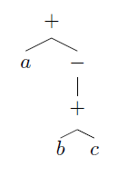

## 6.2 Three-Address Code

### 6.2.1

> Translate the arithmetic expression `a + -(b+c)` into:

> a) A syntax tree.

> b) Quadruples.

|  | $$op$$ | $$arg_1$$ | $$arg_2$$ | $$result$$ |
|-:|:------:|:---------:|:---------:|:----------:|
| 0|    +   |     b     |     c     |     t1     |
| 1|  minus |     t1    |           |     t2     |
| 2|    +   |     a     |     t2    |     t3     |

> c) Triples.

> d) Indirect triples.

### 6.2.2

> Repeat Exercise 6.2.1 for the following assignment statements:

> i. `a = b[i] + c[j]`.

> ii. `a[i] = b*c - b*d`.

> iii. `x = f(y+1) + 2`.

> iv. `x = *p + &y`.

### 6.2.3

> Show how to transform a three-address code sequence into one in which each defined variable gets a unique variable name.

