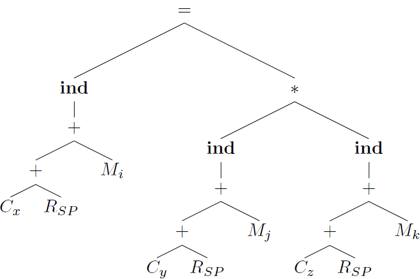

## 8.9 Instruction Selection by Tree Rewriting

### 8.9.1

> Construct syntax trees for each of the following statements assuming all nonconstant operands are in memory locations:

> a) `x = a * b + c * d`


```
LD  R1, a
LD  R2, b
MUL R1, R1, R2
LD  R3, C
LD  R4, d
MUL R3, R3, R4
ADD R1, R1, R3
ST  x, R1
```

> b) `x[i] = y[j] * z[k]`



```
LD  R1, j
LD  R2, y(R1)
LD  R3, k
LD  R4, z(R3)
MUL R2, R2, R4
LD  R5, i
LD  R6, x(R5)
ST  *R6, R2
```

> c) `x = x + 1`


```
LD  R1, x
INC R1
ST  x, R1
```

### 8.9.2

> Repeat Exercise 8.9.1 above using the syntax-directed translation scheme in Fig. 8.21 in place of the ree-rewriting scheme.

### 8.9.3

> Extend the tree-rewriting scheme in Fig. 8.20 to apply to while-statements.

### 8.9.4

> How would you extend tree rewriting to apply to DAG's?
